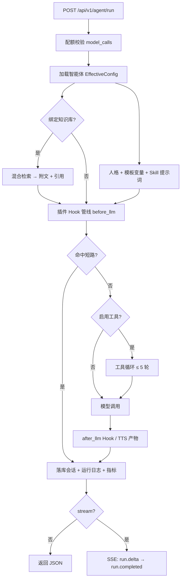

# 白雾·智能体交互平台（Agent Platform）

> 一个运行入口，按需要装配模型、知识、工具与记忆。

白雾是一个面向多租户场景的 AI 智能体运行平台。它把「创建一个能干活的智能体」拆成
两件事：**在仪表盘上定义它是什么**（人格、提示词、生成参数、能力挂载），以及**在运行时决定它
拥有什么**（用哪个模型、带不带知识库、能不能调工具、挂了哪些插件与技能）。

平台不绑定任何一家模型厂商，也不要求先把 Redis、Milvus、Kafka、MinIO 全部装齐：所有外部能力
都有开关与降级，缺谁都能跑，接上才算数。因此它可以从「克隆 → 启动 → 发一条消息拿到 Mock 回复」
开始，逐步长成一套生产可用的智能体服务。

当前版本：`1.1.0`。提供统一运行入口（JSON / SSE）、多模型路由与凭证分层、
会话记忆（短期缓存 + 早期摘要 + 用户画像 + 向量召回）、RAG 知识库、工具与 MCP（**四种传输**）、
自研 DAG 工作流、Skills 开放标准目录、插件热插拔、多模态输入（含图片视觉）、运行日志与三级诊断，
**让智能体读写文件**（工作区约束 + 工具审批 + 改前快照回滚 + 凭证隔离 + 调用过程可视化），
以及**皮肤（换肤）体系** —— 第三方皮肤可以在不改平台代码的前提下接管界面外观。

工程层：**可选内置库**（`DB_MODE=embedded` 用 H2 免装 MySQL 直接跑）、**Spring AI 通道**
（**默认开启**：模型调用 / 原生 tool-role 工具循环 / RAG 解析切分 / 可观测走 Spring AI 2.0.1；
用 `SPRING_AI_ENABLED=false` 可一键回退自研实现，凭证三级回退与加密始终不变）。

## 文档导航

- **扩展指南与部署（K8s/Helm、演示脚本、可观测性运维）**：[docs/guides.md](docs/guides.md)
- 端到端演示脚本：[docs/demo-script.sh](docs/demo-script.sh)
- 桌面应用（Electron 壳 + jlink 运行时，**绿色版免安装**）：[desktop/](desktop/)（构建与分发见 [docs/guides.md](docs/guides.md) §2.7）
- 可观测栈（Loki / Tempo / Prometheus / Grafana）：[docker-compose.observability.yml](docker-compose.observability.yml)

> 需求现状、技术选型依据、待办与路线决策、阶段验收报告等属于**内部资料**，不随本仓库发布 ——
> 本仓库只保留这份 README 与扩展/部署指南。

## 它解决什么问题

写一个「能用的智能体 Demo」不难，难的是让它**可配置、可观测、可演进**：换个模型要不要改代码？
加个知识库要不要重启？工具调用失败了怎么排查？提示词好不好由谁来判断？

平台把这些问题的答案收敛到同一个运行时里：

- **模型是可替换的后端**，不是写死在代码里的 SDK —— 一个 `ModelAdapter` 抽象，下面挂 OpenAI
  兼容、Anthropic、规则引擎与 Mock 四种实现，按 `provider` 路由。
- **能力是可挂载的**，不是硬编码的分支 —— 知识库、工具、插件、Skill 都通过智能体的
  `capabilities` 声明，运行时按需装配，未装配就等于不存在。
- **外部依赖是可退化的**，不是启动前置条件 —— Redis、Milvus、Kafka、MinIO 全部可选，缺失时
  走内存/本地磁盘兜底，健康检查会如实报告，但不会阻断启动。
- **每次运行都是可追溯的** —— 一次运行带一个 `traceId`，模型调用、工具调用、RAG 命中、
  插件短路、错误堆栈全部落 MySQL，重启不丢，并可按 trace 看瀑布图。

## 核心结构

### 一个运行入口，按需装配

所有对话都走 `POST /api/v1/agent/run`（`stream=true` 时返回 SSE）。入口本身很薄，真正的工作
在 `AgentRuntimeService`：加载智能体配置 → 合并生成参数 → 组装提示词 → 检索知识 → 挂载插件 →
回放会话 → 调用模型 → 落库与记账。

「按需装配」体现在运行时的每个可选依赖都是 `@Autowired(required = false)`：注入了就生效，
没注入就跳过，且跳过不会抛错。这让同一份代码既能跑在完整生产环境，也能跑在「没有 MySQL 的
最小环境」——内置库模式（H2）下甚至外部数据库都不需要。

### 模型层：一个抽象，多种后端

| 适配器 | 适用 |
| --- | --- |
| `OpenAiCompatibleAdapter` | OpenAI / DeepSeek / 通义 / 混元 / 文心 等 OpenAI 兼容端点，以及 LiteLLM 中转 |
| `AnthropicAdapter` | Claude 原生消息协议 |
| `RuleEngineModelAdapter` | 不调模型，按规则产出确定性回复（教学/演示/回放） |
| `MockModelAdapter` | 本地兜底，无 Key 也能跑通全流程 |

`ModelRouter` 按 `provider` 选择适配器，`ModelBindingService` 决定最终生效的模型与凭证：
智能体自定义绑定 → 平台默认模型 → 配置项兜底，逐级回退。凭证以 AES-GCM 加密落库，接口只回
掩码，不会把明文 Key 送到前端。

> **Spring AI 通道（默认开启）**：OpenAI 兼容与 Anthropic 的协议层由 Spring AI 2.0.1 的 `ChatModel`
> 实现（底层为官方厂商 SDK：`openai-java` / `anthropic-java`，自定义 UA 经请求头透传、
> 429/5xx 由 SDK `maxRetries` 重试）；**上层的凭证解析、加密/掩码、三级回退一行未动**，
> 只是适配器换实现。设 `SPRING_AI_ENABLED=false` 回到自研适配器，两条链路都有测试守护。

### 提示词：人格 → 模板 → 变量 → Skill

系统提示词不是一段死文本，而是四层拼出来的：

1. **人格（Persona）**：角色、语气、风格、亲和度、禁区，翻译成提示词段；
2. **提示词模板**：支持 `{{user}}`、`{{tenant}}`、`{{agent_id}}` 变量，运行时填充；
3. **Skill 正文**：智能体挂载的 Skill，其 `SKILL.md` 正文以 `## Skill：xxx` 追加；
4. **RAG 附文**：知识库命中片段拼成「知识库资料（只读参考）」，要求模型标注来源编号。

任一层读取失败都只降级跳过，不阻断本轮对话。

### 记忆：短期缓存 + 中期早期摘要

会话与消息落在数据库，运行结束后由 `SessionService.recordExchange` 写入本轮
`user + assistant` 交换；下一轮按 `maxHistoryTurns`（默认 10 轮）回放历史，让对话「有记忆」。

近期上下文额外走 `SessionRecentCache`（Redis List，25 轮 / 50 条 / 24h）：读优先缓存、miss
回 DB 回填、写后追加裁剪。Redis 缺失时全程降级到 DB，功能不减，只是少一层加速。

**中期记忆（早期摘要）**：会话超过 40 轮后，上下文窗口开始截断最早轮次——`SessionSummaryService`
会把这段「即将被丢弃」的早期消息懒压缩成要点，续接进系统提示词（`session_def.summary`，幂等）。
长对话因此仍「记得开头」；摘要当前为离线要点式，可平滑替换为 LLM 语义摘要。

### RAG：摄取 → 混合检索 → 引用溯源

文档经「解析 → 切分 → 向量化 → 索引」进入知识库；检索由 `HybridRetriever` 做向量 + FULLTEXT
混合召回并 rerank，命中片段同时产出 `references`，前端可点开溯源到文档与页码。
解析/切分默认走自研实现；`SPRING_AI_RAG_ENABLED=true` 时可切换到 Spring AI 的
`TikaDocumentReader + TokenTextSplitter`（混合检索本身始终自研，不受影响）。

向量库默认 `in-memory`（8 维伪向量，纯本地演示），切 `milvus` 即接真实向量库。智能体可通过
`capabilities.knowledgeBaseIds` 默认绑定知识库，请求级 `context.rag` 可临时覆盖。

对话拖入的文档也会自动摄取进租户级「对话附件库」（`__chat_attachments__`），并入当次检索并带引用，
让大文件不必整篇塞进上下文。

### 工具与 MCP：注册中心统一执行

`ToolRegistry` 是唯一的工具来源：内置工具、HTTP 注册工具、MCP 接入的工具都注册到这里。
**HTTP 工具注册会持久化**（`tool_registration` 表），重启 / 重新构建后自动恢复。
内置**天气工具**开箱即用：城市名自动做 URL 编码后查询 `wttr.in`。运行入口按请求里的
`tools.enabled` 与 `allowed` 白名单决定本轮暴露哪些工具声明。

MCP 支持**四种传输**，都经同一套 `McpClient` 契约与工厂：**Streamable HTTP**（接远程服务）、
**进程内**（轻量内置）、**沙箱脚本**（子进程 + 目录隔离 + 解释器白名单）、
以及 **stdio 子进程** —— 后者是挂 `npx` / `uvx` 拉起的官方 server（filesystem / git 等）
的途径，注册时传启动命令数组即可，例如
`{"command":["npx","-y","@modelcontextprotocol/server-filesystem","D:/repo"]}`。
stdio 的 server 是常驻进程，提供断开（`POST /tools/mcp/disconnect`）与清单查询
（`GET /tools/mcp/connections`）来回收。

工具与 MCP 各自带**市场**，不必手写注册 JSON：HTTP 工具市场（`GET /api/v1/tools/market`）
提供一份免 Key 的公开 API 清单，清单位于 `resources/tool-market.json`，**新增条目不用改代码**；
MCP 市场（`GET /api/v1/tools/mcp/market`）直连官方 `registry.modelcontextprotocol.io`，
目前**只列 `streamable-http` 型**（stdio 型条目只给包名、不给可执行的启动命令，
放开会让「一键注册」退化成「自己拼命令」，故暂缓）。

工具循环走**原生 tool-role 协议**（`assistant(tool_calls)` → `tool(result)` → 再问一次），
每轮只往消息序列尾部追加两条消息，轮数上限可配
（`agent-platform.agent.tool.max-rounds`，默认 **20**）。
所有工具声明发给模型前统一做 schema 规范化（缺省补 `type:object`），杜绝厂商侧 400。
**过程对用户可见**：每轮回答下方给出可折叠的调用记录（调用次数 / 失败数 / 总耗时，
逐条可展开看参数与结果）。

**让智能体读写文件**是平台的一等能力（可选开启，工作区根默认是空目录）：
**工作区根约束**（含符号链接防绕过）+ `fs` 工具组（读带行号 / 列目录 / glob / grep /
精确串替换 / 全量写）+ **工具审批**（两步式审批页 + 等待用户确认的就地弹窗，
超时降级为两步式）+ **改前快照与回滚** + **凭证隔离**——`.env`、密钥、`.ssh`、shell 启动文件、
以及能让目录"伪装成 git 仓库"的顶层条目一律**读写皆拒，且刻意不参与审批**
（读取是"已经发生"的动作，批准也收不回来）。

### 项目动作：让它能跑测试，但不给它自由命令

**受限动作集**（可选开启，需要一个已配置的工作区）：开箱可用 `git_status` / `git_diff` /
`git_log`，以及按项目类型自动决定的 `run_tests` / `run_build`
（识别 Maven / Gradle / npm / pytest / Go / Cargo）。
项目特有的动作（代码生成、数据库迁移…）可在 `data/tool-actions.json` 里用**命令模板**注册。

关键在于**模型不能构造命令**：它只能选择跑哪个动作、并填受字符白名单约束的参数。
这样"改代码 → 跑测试 → 再改"的闭环成立，而"模型即兴拼一条命令"这个风险源**根本不存在** ——
不是把它隔离掉，是让它不产生。

> 为什么不做自由 shell：逐条审批已被数据否定（Anthropic 遥测：约 93% 的权限提示是无意识批准的），
> 而桌面版可用的 OS 级沙箱（微软 MXC）官方明说"不应被视为安全边界"，且其 Windows 后端
> 缺少网络隔离。详见 `docs/technology.md`。

### 插件：Hook 管线与 ClassLoader 隔离

插件通过 `AgentPipeline` 挂到模型调用前后，四个钩子点各有明确约定：`before_llm` 可**短路**
（直接返回预设答复）或**改写输入**，`after_llm` 可附加产物（如合成音频的地址），
`before_output` 可**替换最终输出**（脱敏 / 合规改写的唯一落点），`on_error` 提供**兜底话术**。
完整示例见 `plugin-example` 模块（4 个插件 + 4 份 manifest）。

代码里的 `@Component` 插件会由 `BuiltinPluginRegistrar` 自动同步进插件市场
（平台租户 `__platform__`，不可删除、对所有租户可见）；外部插件以独立
`PluginClassLoader` 加载 jar，Attach / Detach 热插拔，卸载即反注册钩子与工具。

外部插件有两条进入路径：**从插件市场取**（`/plugins/marketplace`），或**从仪表盘直接上传**
（`POST /plugins/upload`，multipart 提交 manifest + jar；也支持 `/import?artifactUri=`）。
jar 落在 `agent-platform.plugin.artifact-dir`（默认 `./data/plugins`）后由 `ExternalPluginLoader` 装载。

### Skills：开放标准目录，挂载即生效

Skills 采用 Agent Skills 开放标准布局 `skills/<name>/SKILL.md`（可选 `scripts/`、`references/`、
`assets/`）。把下载的技能包放进目录 → 仪表盘点「扫描同步」→ 智能体在 `capabilities.skillIds`
引用 → 运行时正文自动拼进系统提示词。不需要打包、不需要改代码。

目录里没技能也不要紧 —— 有**技能市场**（`GET /api/v1/skills/market`）可以直接列举并一键安装。
取件按 `ghproxy → jsDelivr → GitHub 直连` 的顺序**失败切换**（国内直连 `api.github.com` 常被拒，
代理通道因此是首选），也支持粘贴任意仓库或文件地址直接读取。

### 智能体：可版本化的配置

智能体本身只是一份配置（`AgentDefinition`）：人格、系统提示词、生成参数、能力挂载。配置可存
版本快照、发布、回滚，也能对比两个版本的差异。删除为物理删除，列表默认隐藏归档。

前端行为也按「一次运行」的语义对齐：对话历史切页不丢，只有主动「新对话」才写入新的会话历史。

### 工作流：拖拽画布 + 自研 DAG 引擎

编排有两层：**画布**（`/workflows` → 点「画布」）与**引擎**。

**创建工作流即直接进画布**（弹窗只填名称/描述，定义由画布自动生成，无需手写 JSON）。

画布基于 **FlowGram 固定布局**（与 Coze 工作流同源的内核），交互形态与 Coze 一致：

- **画布拖拽平移 + 滚轮缩放**（左键拖空白处即平移）；
- **节点整卡拖拽重排**，拖到两节点之间松手即插入到该处；
- 节点之间 / 分支内的**内联「+」**：点击弹出节点库，新节点**精确插在加号所在位置**；
- 分支可折叠展开，全程支持撤销 / 重做。

节点覆盖 **LLM、知识库、代码（Skill）、HTTP、插件、工具、Agent、条件分支、变量转换**；右侧配参数
（表单随类型变化），底部「试运行」会按节点展示执行轨迹（状态 / 耗时 / 入出参）。「发布」生成已发布
快照并递增版本号，草稿可继续编辑、支持一键回滚。

引擎侧是自研 `DagEngine`：条件分支 + 虚拟线程并行，节点带 Schema 校验（含"类型必须有执行器"——
**缺执行器的节点在保存时就被拦下**，不会等到运行时才炸）。

### 多模态：parts[] 消息模型

消息内容除了纯字符串，也支持 `parts[]`：`text` 块直接拼接，`file` 块按 `fileId` 读取文件文本
后注入 `[文件：name]` 区块；`image` 块会把图片发给支持视觉的模型（Spring AI 通道，`data: URL`）。
单轮最多读取 4 个附件，单文件最多 100k 字符（超出标注截断），解析失败只影响该附件，不阻断整轮。

### 日志、诊断与可观测

运行日志统一经 `LogService` 落 MySQL，并通过 `LogEventSink` 出口外推：Micrometer 指标、
Loki 日志、Tempo / Jaeger Span。故障排查有三级诊断（规则 → 向量 → LLM），提示词另有 6 维评分
与优化建议。

### 皮肤：把界面交给第三方

界面不是做死的。**皮肤是一份第三方 JS bundle**：用户显式启用后由宿主注入执行，它自带样式与资源，
通过宿主挂在 DOM 上的**契约钩子**（`data-slot` / `data-pane` / `data-phase` / `data-composer-seat` …）
认领自己关心的区域，从而在不改平台代码的前提下接管界面外观。

- **皮肤市场**：列出可安装皮肤并一键装到 `data/skins/<id>/`，同时支持卸载、资源代理与 bundle 读取。
- **契约版本**：钩子集合有任何增删改都要让 `CONTRACT_VERSION` 递增 —— 它同时是「某皮肤支持度结论」
  缓存的 key，改了钩子就必须重测。
- **设置面板**：皮肤通过 DSH 自定义协议**声明自己的设置项**，宿主负责持久化、渲染面板并把改动回调给皮肤。
  **属性名是皮肤自己的事，宿主不需要认识任何一个** —— 所以任何遵守协议的皮肤都能被同一个面板管理。
- **窗口标题归宿主所有**：皮肤可能写死它原宿主的产品名，因此标题由宿主持有、不接受改写
  （`skin/titleGuard.ts`）。
- **DOM 层级必须照皮肤期望摆**：皮肤大量使用 `>` 子选择器与结构定位，把两层语义合并到一个元素上会让
  规则静默失效（设置面板与输入卡片都踩过）。

皮肤是**在页面里执行的第三方代码**，因此只有用户明确启用过的皮肤，才会在下次启动时自动加载。

## 一次运行如何被处理



```text
请求进入（JSON 或 SSE）
        ↓
生成 runId / traceId，进入 TraceContext
        ↓
加载智能体配置 → 合并生成参数 → 解析模型绑定与凭证
        ↓
提取用户消息（纯文本 或 parts[] 含附件）
        ↓
组装系统提示词：人格 → 模板变量 → Skill 正文 → RAG 附文
        ↓
确保插件已热挂载 → 回放会话历史
        ↓
插件 before_llm → 模型调用（必要时进入工具循环）→ after_llm
        ↓
写入会话交换、运行日志与指标
        ↓
返回响应（含 usage、引用溯源、插件产物）
```

## 安装

### 环境要求

| 依赖 | 版本 | 是否必需 | 说明 |
|------|------|----------|------|
| JDK | **21 或更高** | ✅ 必需 | 使用预览特性 `ScopedValue`，编译/运行均需 `--enable-preview`（脚本已自动带） |
| Maven | 3.9+ | ✅ 必需 | 构建依赖；首次构建需联网 |
| MySQL | 8.x | ✅（默认） | 默认必需；不想装 MySQL 可改用内置 H2：`DB_MODE=embedded`（见「快速开始」方式 C） |
| Redis | 7 | ❌ 可选 | 缺失时仅健康检查 DOWN，配额与会话缓存走内存兜底 |
| Node / npm | 18+ | ❌ 可选 | 仅修改前端源码并重建时需要 |
| Docker | — | ❌ 可选 | 便捷拉起 MySQL / Redis；不使用则手动装 MySQL |
| Milvus / Kafka / MinIO / LiteLLM | — | ❌ 可选 | 全部有开关与降级，默认不开 |

> 首次构建 `mvn package` 需要能访问 Maven Central；首次前端构建需要能访问 npm registry。
> 命令行构建前请确认 `JAVA_HOME` 指向 JDK 21（本机默认的 17 会报「不支持发行版本 21」）。

### 快速开始

#### 方式一：桌面版（推荐日常使用，零依赖）

**不需要安装 JDK / Maven / MySQL / Node** —— 应用自带 jlink 精简 JRE 与内嵌 H2 数据库。

1. 构建（Windows）：双击 `desktop\build.bat`（依次 jlink → 打后端 jar → 打包 → 输出绿色版目录，约 15 秒）
2. 运行：双击 **`desktop\dist\green\Agent Platform.exe`**

- **数据目录**：`%APPDATA%\Agent Platform\data`（**与方式二不通用**，两边各有一套库）
- **日志**：`%APPDATA%\Agent Platform\app.log`（启动失败先看这里）
- 绿色版整个目录可直接拷走，免安装、免解压（`portable` 单文件已弃用：每次启动都要解压约 640MB）
- 改了后端代码后重新跑一次 `build.bat` 再启动即可；**构建前请先关闭应用**

#### 方式二：从源码运行（开发联调 / 服务器部署）

需要 JDK 21（必需）、MySQL 或内置 H2；Node 仅在修改前端源码时需要。

#### 1. 克隆

```bash
git clone https://gitee.com/sxyjyjh/agent-platform.git
cd agent-platform
```

#### 2. 选择数据源（三选一）

**方式 A：用 Docker 起 MySQL（推荐用于开发联调）**

```bash
docker compose up -d mysql redis
```

**方式 B：手动创建**（用本地 MySQL 的 root 执行）

```sql
CREATE DATABASE IF NOT EXISTS agent_platform DEFAULT CHARACTER SET utf8mb4 COLLATE utf8mb4_0900_ai_ci;
CREATE USER IF NOT EXISTS 'agent'@'%' IDENTIFIED BY 'agent123456';
GRANT ALL PRIVILEGES ON agent_platform.* TO 'agent'@'%';
FLUSH PRIVILEGES;
```

> 库名/账号密码与默认配置一致；想改走「配置」一节的环境变量。

**方式 C：内置 H2（免装数据库，最快上手 / 演示 / 分发）**

什么都不用装。启动时追加 `embedded`（见下一步），数据自动落在 `./data/agent-platform.mv.db`
（H2 file，MySQL 兼容模式，Flyway 按厂商自动选用 `h2` 迁移集）。生产仍推荐 MySQL（保 FULLTEXT 全文检索）。

#### 3. 启动

**Windows**（双击或命令行）：

```bat
start-core.bat rebuild             REM 首次/改动后端后用 rebuild；之后可直接 start-core.bat
start-core.bat embedded rebuild    REM 免装 MySQL：用内置 H2（DB_MODE=embedded）
```

**Linux / macOS**：

```bash
chmod +x start-core.sh
./start-core.sh rebuild
# ⚠️ start-core.sh 只认 rebuild 参数，**不提供 embedded**（H2 免装库目前只有 Windows 的
#    start-core.bat 支持）。Linux/macOS 要用内置 H2 请手动启动：
java --enable-preview -jar agent-platform-core/target/agent-platform-core-1.1.0.jar --spring.profiles.active=embedded
```

**或手动方式（任意系统）**：

```bash
mvn -pl agent-platform-core -am package -DskipTests
java --enable-preview -jar agent-platform-core/target/agent-platform-core-1.1.0.jar
```

启动成功日志含 `Tomcat started on port 8081`，随后浏览器打开 **http://localhost:8081/**。

> - 若 **8081 被占用**，脚本会自动杀掉旧进程（Windows）或提示（Linux/macOS）。
> - Redis 没有也不影响核心功能（日志会提示 redis DOWN）。
> - 手动方式启动内置库：`java --enable-preview -jar agent-platform-core/target/agent-platform-core-1.1.0.jar --spring.profiles.active=embedded`

#### 4. 验证

```bash
curl http://localhost:8081/actuator/health
# {"status":"UP","components":{"db":{"status":"UP"}, ... ,"redis":{"status":"DOWN"}}}  ← redis 可为 DOWN
```

仪表盘首屏应能：新建智能体 → 在「对话运行」发消息 → 未配置任何模型 Key 时会自动返回
**本地 Mock 回复**（可先跑通全流程）。

## 配置顺序

建议按以下顺序配置，更快建立可验证的闭环：

1. **跑通 Mock**：先不配任何 Key，确认「新建智能体 → 发消息 → 拿到回复」闭环可用。
2. **平台默认对话模型**：仪表盘「模型设置」选服务商 → 填模型、baseUrl、API Key → 保存。
3. **平台嵌入模型**：同上，填嵌入模型（如 `BAAI/bge-m3`），供 RAG 向量化使用。
4. **建一个知识库**：上传文档 → 等待摄取完成 → 在智能体 `capabilities` 绑定 → 对话验证引用溯源。
5. **挂 Skill / 插件**：把 Skill 放进 `data/skills/` 后「扫描同步」；插件在市场导入后 Attach 到智能体。
6. **按需开工具**：请求里带 `tools.enabled` 与白名单，验证工具循环；需要外部能力再接 MCP。
7. **可选设施**：`VECTOR_STORE=milvus`、`STORAGE_TYPE=minio`（Kafka 事件总线已默认开启，无需额外配置；要关设 `EVENTS_ENABLED=false`）。
8. **生产加固**：开启鉴权、覆盖密钥、配置静态账号（见「从演示到生产」）。

单个智能体也可覆盖平台默认：编辑智能体时勾选「为该智能体自定义模型 / API Key」。

## 配置

平台开箱即用，绝大多数能力可用环境变量开关控制，**无需改任何代码/配置文件**：

| 环境变量 | 作用 | 默认 |
|----------|------|------|
| `MYSQL_URL` / `MYSQL_USER` / `MYSQL_PASSWORD` | 数据源 | `localhost:3306/agent_platform` / `agent` / `agent123456` |
| `SKILLS_DIR` | Skills 目录（标准 SKILL.md 布局） | `./data/skills` |
| `SKILLS_OPEN_FOLDER` | 是否允许仪表盘打开系统文件管理器 | `false`（本地桌面可设 `true`） |
| `STORAGE_TYPE` | 文件存储：`local` / `minio` | `local`（本地磁盘 `./data/files`） |
| `VECTOR_STORE` | 向量库：`in-memory` / `milvus` | `in-memory` |
| `EVENTS_ENABLED` | Kafka 事件总线开关（broker 不可用时静默降级；桌面 embedded 强制关） | `true` |
| `SECURITY_ENABLED` | core 侧 JWT 鉴权开关 | `true`（**默认开启**；关闭需显式设 `false`） |
| `JWT_SECRET` / `MODEL_KEY_ENC_KEY` | JWT 密钥 / 模型 Key 加密主密钥 | `change-me-*`（**生产务必覆盖**） |
| `AUTH_USERNAME` / `AUTH_PASSWORD` | 登录静态账号（配置后登录需校验） | 空（演示模式签发） |
| `DEFAULT_PROVIDER` / `DEFAULT_MODEL` | 未配置时的模型厂商/型号 | `deepseek` / `deepseek-chat` |
| `embedded`（`--spring.profiles.active=embedded`） | 内置 H2 库模式（免 MySQL，数据 `./data/agent-platform.mv.db`）；脚本用 `start-core.bat embedded` | 默认 mysql |
| `SPRING_AI_ENABLED` | 模型调用 / 工具循环 / 可观测走 Spring AI 2.0.1（`false` = 回退自研实现） | `true` |
| `SPRING_AI_RAG_ENABLED` | RAG 解析 / 切分走 Spring AI（TikaDocumentReader + TokenTextSplitter） | `true` |

> 说明：`data/` 下目录运行期自动生成；所有外部能力默认关闭、本地 Mock/内存/磁盘兜底，
> 保证「克隆即可跑」。

### 可选能力接线（Docker）

```bash
docker compose up -d                      # 全部可选设施（含 Kafka broker）
export VECTOR_STORE=milvus STORAGE_TYPE=minio SECURITY_ENABLED=true
start-core.sh rebuild                     # 或手动 java --enable-preview -jar ...
```

| 能力 | 接线方式 |
|------|----------|
| 真实对话/嵌入 | 仪表盘「模型设置」填 Key（直连，不经 LiteLLM）；或起 LiteLLM + `.env` 填 `DEEPSEEK_API_KEY` 等 |
| Milvus 向量 | `VECTOR_STORE=milvus`（维度变化自动重建 collection，旧文档需重新上传） |
| MinIO 文件 | `STORAGE_TYPE=minio`（默认 `MINIO_ENDPOINT/ACCESS/SECRET` 见 `application.yml`） |
| Kafka 事件 | **默认开启**；`docker compose up -d kafka` 提供 broker（无 broker 时发送失败静默降级，不阻断业务） |
| 生产鉴权 | `SECURITY_ENABLED=true` + 覆盖 `JWT_SECRET` + 配置 `AUTH_USERNAME/AUTH_PASSWORD` |

## 前端（仪表盘）

生产版：core 同源托管 `src/main/resources/static/`（已随仓库提交）。**改过前端源码后必须重建：**

```bash
# Windows
agent-platform-ui\build-ui.bat            # 或: cd agent-platform-ui && npm install && npm run build:prod
# Linux / macOS
./build-ui.sh                             # 同上等价
```

开发模式（热更新，代理 /api 到 8081）：

```bash
cd agent-platform-ui && npm install && npm run dev   # 访问 http://localhost:5173/
```

> 改动后端后需重启 core；改动前端后需重新 `npm run build:prod` 再重启（或直接访问 5173）。
> 静态资源已设 `cache-control: no-store`，一般无需 `Ctrl+F5`；桌面版启动时会主动清 HTTP 缓存，
> 重启即生效。

界面上有三个刻意的取舍，先说清楚省得被当成缺失：

- **顶部 Header 与侧栏底部的租户/登录入口已撤掉** —— 前者挡住皮肤铺满整页、信息又与侧栏重复；
  后者的账户体系尚未落地，点下去没有后果。**接口全部保留**，需要时接回来即可。
- **弹窗可拖拽** —— 所有 antd Modal 与皮肤设置面板都能拖标题栏移动，双击标题栏复位。
  它是**全局安装**的（扫描 DOM 自动挂），所以以后新增的弹窗也自动具备，不需要每个调用点记得加。
- **窗口标题固定由宿主持有**，不受皮肤影响（原因见「皮肤」一节）。

## 数据目录（运行时自动创建，无需预先存在）

| 目录 | 内容 |
|------|------|
| `./data/skills/` | Skills 目录（Agent Skills 标准：`skills/<name>/SKILL.md` + 可选 `scripts/ references/ assets/`）；首次启动自动铺示例，下载的 Skill 放进目录后点「扫描同步」即可识别 |
| `./data/files/` | 文件上传的本地存储（`STORAGE_TYPE=local`） |
| `./data/plugins/` | 外部插件 jar 制品（可选） |
| `./data/agent-platform.mv.db` | 内置库模式（`embedded`）的 H2 数据文件（迁移前请备份） |

## API 概览（前缀 `/api/v1`）

| 域 | 端点 |
|----|------|
| 智能体 | `/agents` CRUD / 版本 / 发布 / 回滚 / diff |
| 会话 | `/sessions` CRUD、`/sessions/import`、`/sessions/{id}/messages` |
| 对话运行 | `/agent/run`（JSON 或 SSE） |
| 知识库 | `/knowledge-bases`、`/{id}/documents`、`/{id}/chunks`、`/documents/{docId}`、`/search` |
| Skills | `/skills` CRUD、`/sync`、`/upload`、`/import-folder`、`/open-folder`、`/{id}/files`、`/{id}/file` |
| 插件 | `/plugins` 市场 / 导入 / 删除 / attach / detach |
| 工具 | `/tools` 列表 / invoke / HTTP 注册 / MCP（四种传输）/ 断开连接 / 卸载 |
| 模型配置 | `/model-config`（`/embedding`、`/chat`） |
| 日志/诊断 | `/logs`（查询/导出/瀑布图/purge）、`/diagnosis` |
| 文件/配额/提示词 | `/files`、`/quotas`、`/prompt` |

## 日志与排查

建议排查顺序：

1. 先看 `actuator/health`：确认 `db` UP；`redis` 为 DOWN 属正常降级。
2. 拿到响应的 `traceId`，在仪表盘「运行日志」里按 trace 看瀑布图（模型调用、工具调用、RAG、
   插件各占多少耗时）。
3. 模型调用失败：核对「模型设置」里的 provider、baseUrl、Key 是否匹配，日志中 `llm.call`
   会打印实际生效的 `provider` 与 `model`。
4. RAG 命中为空：确认知识库已绑定（`capabilities.knowledgeBaseIds` 或请求 `context.rag`），
   文档摄取已完成，且 `topK` / `scoreThreshold` 不是过严。
5. 工具无效果：确认请求带了 `tools.enabled=true`，且工具名在 `allowed` 白名单内（留空表示全部）。
6. 需要长期留存与告警：起 `docker-compose.observability.yml`，Grafana 对接 Prometheus / Loki /
   Tempo，详见 [guides.md](docs/guides.md) 的可观测性运维章节。

## 使用边界

- 平台依赖模型的指令遵循与结构化输出能力。较小或不稳定模型的工具调用与引用标注质量会下降。
- 内置向量库为纯内存伪向量，仅供演示；真实检索质量请接 `milvus` 与真实嵌入模型。
- 内置库模式（H2）无 FULLTEXT 全文索引，稀疏检索由顺序扫描兜底（功能可用、文档量大时慢）；生产/大规模仍用 MySQL。
- 图片视觉依赖 Spring AI 通道（`SPRING_AI_ENABLED=true`）且模型支持视觉（如 `gpt-4o-mini`）；未开启时图片不发送、文本对话正常。
- 未开启 `SECURITY_ENABLED` 时所有接口无鉴权，仅适合本地/内网演示。
- 默认 `JWT_SECRET`、`MODEL_KEY_ENC_KEY` 为占位值；开启鉴权但仍用默认密钥时启动守卫会拒绝启动。
- 知识的准确性取决于上传的资料；医疗、法律、金融等高风险场景应由专业人员复核后再使用。
- 误删智能体为物理删除（列表默认隐藏归档），清理日志前建议先导出。

## 从演示到生产

1. 覆盖 `JWT_SECRET`、`MODEL_KEY_ENC_KEY`；
2. 配置 `AUTH_USERNAME` / `AUTH_PASSWORD`（或接入 OAuth2 / LDAP）；
3. 开启 `SECURITY_ENABLED=true`；
4. 服务端部署设置 `SKILLS_OPEN_FOLDER=false`（默认已关）、`STORAGE_TYPE=minio`、`VECTOR_STORE=milvus`；
5. 把 `data/` 挂到持久化卷，日志定期 `DELETE /api/v1/logs/purge`。

## 开发与验证

```bash
mvn -pl agent-platform-core -am package -DskipTests   # 构建可执行 jar
mvn test                                              # 386 个单元测试（54 个测试类；含 Spring AI 通道、内置库迁移、记忆、工具、工作流画布后端等）
warmup.bat                                            # Windows：依赖预热，"warmup.bat verify" 校验离线构建
cd agent-platform-ui && npm run build:prod            # 前端构建，产物同步到 core 的 static/
```

构建产物位于 `agent-platform-core/target/`。Windows 上若 8081 仍有进程监听，jar 会被占用而打包失败，
先停服务再构建。

---

技术栈：Java 21（虚拟线程 + ScopedValue）、Spring Boot 4.1、Spring Data JPA + Flyway、
MySQL 8（或内置 H2，`DB_MODE=embedded`）、Redis（可选）、Milvus（可选）、Spring AI 2.0.1（可选通道）、
React + Vite + antd、**FlowGram**（拖拽式工作流画布，与 Coze 同源内核）、**Electron + jlink**（桌面绿色版）。
